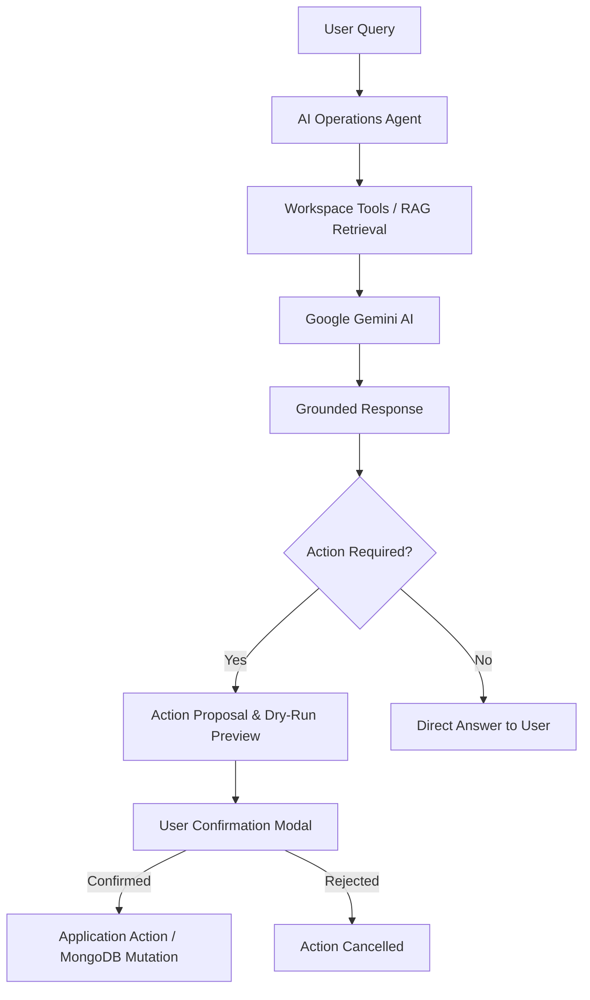

<div align="center">

# 🚀 ClubOps AI

### AI-Powered Operations Platform for College Clubs

**Team:** NextBuildX &nbsp;|&nbsp; **Problem Statement:** PS-3 — ClubOps AI &nbsp;|&nbsp; **Hackathon:** BIT N BUILD’26 Gujarat Round

[](docs/hackathon/JUDGE_EVALUATION.md)
[](LICENSE)
[](https://nodejs.org)
[](https://mongodb.com)
[](https://deepmind.google/technologies/gemini/)
[](https://react.dev)
[](https://vitejs.dev)

**ClubOps AI transforms chaotic college club operations into a unified, intelligent, and grounded workspace — plan events, extract meeting actions, allocate volunteers, analyze risks, query club documents with RAG, and execute operational workflows with human-confirmed AI actions.**

[📸 Screenshots](#-screenshots) · [⚡ Quick Start](#-quick-start) · [🏗 Architecture](#-architecture) · [🤖 AI & RAG Workflows](#-ai-workflows) · [🎬 Demo Flow](docs/DEMO.md) · [📡 API Reference](docs/API.md) · [🔑 Demo Credentials](#-demo-credentials)

</div>

---

## 📌 Problem

College clubs coordinate events, tasks, volunteers, meetings, documents, deadlines, risks, and announcements across disconnected tools such as WhatsApp chats, spreadsheets, and shared drives.

As events scale:
- Meeting decisions and action items get buried in chat histories.
- Tasks are assigned verbally and forgotten.
- Operational risks (overdue milestones, unassigned critical tasks, volunteer shortages) are discovered too late.
- Club documents, budgets, and policies gather dust instead of answering member questions.
- Organizers spend hours drafting and dispatching announcements manually.

---

## 💡 Solution

**ClubOps AI** centralizes the complete club operations lifecycle into a single, multi-tenant workspace augmented by Gemini AI and Retrieval-Augmented Generation (RAG).

- **Centralized Club Operations:** Manage events, Kanban task boards, volunteer rosters, meetings, risk matrices, and announcements in one cohesive application.
- **AI-Powered Assistance:** An AI Command Center operations agent queries workspace data, finds unassigned tasks, and proposes actionable mutations.
- **Meeting Intelligence:** Upload raw meeting notes or transcripts to automatically extract summaries, decisions, action items, task owners, and deadlines.
- **Grounded Club Knowledge (RAG):** Upload club bylaws, guidelines, and budgets to query exact policies with source citations and zero external hallucinations.
- **Proactive Risk Intelligence:** Hybrid heuristic and LLM risk engine flags milestone delays, volunteer deficits, and dependencies with mitigation strategies.
- **Human-Confirmed AI Actions:** Safety-first design where AI proposals require explicit organizer approval before mutating database records.
- **WhatsApp & Multi-Channel Announcements:** Draft announcements with AI and resolve recipients from profile contact data with automated WhatsApp recipient delivery.

---

## ✨ Key Features

### 🏢 Club Operations
- **Event Management:** Full event lifecycle tracking (planning, active, completed), venue tracking, attendee capacity, and live completion metrics.
- **Task Management:** Kanban board and list views with priorities (`low` → `urgent`), assignees, due dates, and status tracking (`todo`, `in_progress`, `review`, `completed`).
- **Volunteer Coordination:** Department registry, availability states (`available`, `assigned`, `busy`, `unavailable`), skill tags, and profile contact management.
- **Meeting Management:** Meeting creation, agenda tracking, attendee lists, transcript uploads, and one-click action-item conversion to tasks.
- **Risk Management:** Severity (`low` → `critical`) × Probability matrix with mitigation plans and milestone dependency tracking.
- **Announcements:** Multi-channel broadcast composer supporting audience targeting (Entire Club, Event Participants, Volunteers, Organizers, Custom).

### 🤖 AI Capabilities
- **AI Command Center:** Conversational operations copilot powered by Gemini function calling with full workspace context tools.
- **Meeting Summarization & Action Extraction:** NLP parser extracts discrete tasks, resolves member names, and maps natural language dates.
- **RAG Knowledge Base Search:** Semantic vector search across uploaded PDFs, Word docs, and policies with page-level citations.
- **Risk Detection & Analysis:** Detects overdue milestones, unassigned critical tasks, and volunteer bottlenecks with actionable mitigation plans.
- **AI Announcement Generator:** Context-aware announcement drafting and tone adaptation.
- **Action Proposals with User Confirmation:** All AI mutations provide a dry-run preview and require explicit human confirmation.

### 📢 Communication & Delivery
- **In-App Notifications:** Real-time event notifications powered by native Server-Sent Events (SSE).
- **WhatsApp Recipient Flow:** Automatic profile number resolution (`+91...` E.164), readiness checks, and recipient preview.
- **Audience Preview Intelligence:** Real-time calculation of reachable recipients, valid numbers, and missing contact alerts.

---

## 🤖 AI Workflows

### 1. AI Operations Agent Workflow



### 2. Meeting Intelligence Workflow

```mermaid
graph TD
    M[Meeting Notes / Raw Transcript] --> P[AI Transcript Processor]
    P --> G[Gemini Flash (gemini-3.6-flash) NLP Extraction]
    G --> R[Summary + Key Decisions]
    G --> T[Discrete Action Items + Deadlines]
    G --> K[Risk Detection]
    T --> F[Fuzzy Member Name Resolution]
    F --> A[1-Click Convert to Tracked Tasks]
    A --> DB[(MongoDB Task Board)]
```

---

## 🧠 RAG Architecture

ClubOps AI implements a multi-tenant **Retrieval-Augmented Generation (RAG)** pipeline designed for club documents:

```
Document Upload (PDF, DOCX, TXT, MD)
           ↓
Text Processing & Page Normalization
           ↓
Sliding-Window Chunking (800 chars, 100 overlap)
           ↓
Vector Embeddings (Gemini gemini-embedding-001 / 768-dim)
           ↓
MongoDB Multi-Tenant Vector Store ({ club: clubId })
           ↓
Cosine Similarity Vector Retrieval (Top-K Matches)
           ↓
Grounded Context Injection + Anti-Hallucination Prompt
           ↓
Google Gemini (gemini-3.6-flash) Grounded Synthesis
           ↓
Answer with Document & Page Citations
```

* **Multi-Tenant Isolation:** Vector searches strictly enforce the authenticated `clubId` filter — no cross-club data leaks.
* **Page-Aware Citations:** PDF chunks preserve source page numbers for verifiable reference citations.
* **Deterministic Fallback:** Robust offline vector generator ensures local development and testing remain functional without external API keys.

---

## 🏗 Architecture

```
┌─────────────────────────────────────────────────────────────────┐
│                       ClubOps AI Platform                        │
├──────────────────────────────┬──────────────────────────────────┤
│         Frontend             │           Backend                 │
│   React 18 + Vite            │   Express.js + Node.js 18+        │
│   Tailwind CSS + Recharts    │   MongoDB + Mongoose              │
│   React Router v6            │   JWT Authentication + RBAC       │
│   Axios API Client Layer     │   Multer File Parsing Layer       │
└──────────────────────────────┴──────────────────────────────────┘
                                │
        ┌───────────────────────┼────────────────────────┐
        │                       │                        │
 ┌──────┴──────┐         ┌──────┴──────┐          ┌──────┴──────┐
 │  AI Layer   │         │  RAG Engine │          │   Realtime  │
 │ Gemini AI   │         │ Chunker     │          │ Server-Sent │
 │ Function    │         │ Embeddings  │          │ Events (SSE)│
 │ Calling     │         │ VectorStore │          │ Broadcasts  │
 └─────────────┘         └─────────────┘          └─────────────┘
```

### Key Architectural Safeguards
- **Multi-Tenant Scoping:** All database operations and vector queries are automatically scoped to `req.user.club`.
- **Contact Truth:** User profile is the single source of truth for contact details (`name`, `email`, `phone`, `whatsappNumber`).
- **Human-in-the-Loop:** Mutating AI tools return dry-run action proposals before executing changes.
- **Backend-Only Credentials:** API keys, JWT secrets, and provider tokens are strictly kept on the backend.

---

## 📸 Screenshots

<table>
<tr>
<td align="center"><br/><sub><b>Authentication & Role Login</b></sub></td>
<td align="center"><br/><sub><b>Operations Dashboard</b></sub></td>
<td align="center"><br/><sub><b>Event Management</b></sub></td>
</tr>
<tr>
<td align="center"><br/><sub><b>Create Event Modal</b></sub></td>
<td align="center"><br/><sub><b>Kanban Task Board</b></sub></td>
<td align="center"><br/><sub><b>Task Details & Assignees</b></sub></td>
</tr>
<tr>
<td align="center"><br/><sub><b>Volunteer Roster & WhatsApp</b></sub></td>
<td align="center"><br/><sub><b>AI Meeting Intelligence</b></sub></td>
<td align="center"><br/><sub><b>Risk Assessment Matrix</b></sub></td>
</tr>
<tr>
<td align="center"><br/><sub><b>RAG Knowledge Base</b></sub></td>
<td align="center"><br/><sub><b>AI Command Center</b></sub></td>
<td align="center"><br/><sub><b>Announcements & WhatsApp Preview</b></sub></td>
</tr>
</table>

---

## 🧱 Technology Stack

| Layer | Technologies Used |
|---|---|
| **Frontend** | React 18, Vite 6, Tailwind CSS, React Router v6, Axios, Lucide React, Recharts |
| **Backend** | Node.js (18+), Express.js 4.x, Mongoose, Multer |
| **Database** | MongoDB (local or Atlas) |
| **AI & NLP** | Google Gemini (`gemini-3.6-flash`, `@google/generative-ai`), Gemini Embeddings (`gemini-embedding-001`, 768-dim) |
| **Authentication** | JWT (`jsonwebtoken`), Password Hashing (`bcryptjs`) |
| **File Parsers** | `pdf-parse` (PDFs), `mammoth` (Word documents) |
| **Realtime** | Native Server-Sent Events (SSE) |
| **Security** | Helmet.js, CORS, Multi-tenant query isolation |

---

## ⚡ Quick Start

### Prerequisites
- **Node.js** 18+ (tested on v18, v20, v22)
- **MongoDB** (local `mongodb://localhost:27017/clubops_ai` or MongoDB Atlas URI)
- **Google Gemini API Key** (from [Google AI Studio](https://aistudio.google.com/))

### 1. Clone & Install

```bash
git clone https://github.com/NextBuildX/ClubOps-AI.git
cd ClubOps-AI-By-NextBuildX

# Install server dependencies
cd server
npm install

# Install client dependencies
cd ../client
npm install

# Return to root
cd ..
```

### 2. Configure Environment Variables

**Backend** (`server/.env`):
```env
PORT=5000
NODE_ENV=development
MONGODB_URI=mongodb://localhost:27017/clubops_ai
CLIENT_URL=http://localhost:5173
JWT_SECRET=your_jwt_secret_key_here
JWT_EXPIRES_IN=7d
GEMINI_API_KEY=your_gemini_api_key_here
GEMINI_MODEL=gemini-3.6-flash
GEMINI_EMBEDDING_MODEL=gemini-embedding-001

# WhatsApp Configuration (Optional)
WHATSAPP_PROVIDER=cloud_api
WHATSAPP_API_TOKEN=your_whatsapp_token
WHATSAPP_PHONE_NUMBER_ID=your_phone_number_id
WHATSAPP_DEFAULT_COUNTRY_CODE=91
```

**Frontend** (`client/.env`):
```env
VITE_API_BASE_URL=http://localhost:5000/api
```

### 3. Seed Database with Realistic Demo Data

```bash
cd server
npm run seed
cd ..
```

This provisions:
- 2 isolated clubs: NextBuild Tech (`TECH2026`) and Robotics Club (`ROBO2026`)
- 3 personas with pre-configured credentials
- Seeded events, tasks, volunteers, meetings, documents, and risks

### 4. Run Development Servers

From the root directory:
```bash
npm run dev
```

Or start individually:
```bash
# Terminal 1 — Backend (Express on port 5000)
cd server && npm run dev

# Terminal 2 — Frontend (Vite on port 5173)
cd client && npm run dev
```

* **Frontend:** [http://localhost:5173](http://localhost:5173)
* **Backend API:** [http://localhost:5000](http://localhost:5000)
* **API Health Check:** [http://localhost:5000/api/health](http://localhost:5000/api/health)

---

## 🔑 Demo Credentials

| Persona | Email | Password | Role | Club Workspace |
|---|---|---|---|---|
| **Lead Organizer** | `lead@club.edu` | `Password123!` | `organizer` | NextBuild Tech (`TECH2026`) |
| **Event Volunteer** | `rahul@club.edu` | `Password123!` | `volunteer` | NextBuild Tech (`TECH2026`) |
| **Isolation Lead** | `robo.lead@club.edu` | `Password123!` | `organizer` | Robotics Club (`ROBO2026`) |

*Multi-Tenant Guarantee: Data belonging to `TECH2026` is completely inaccessible to users in `ROBO2026`.*

---

## 🎬 Demo Flow for Judges

Follow the complete 16-step demonstration flow in [docs/DEMO.md](docs/DEMO.md):

1. **Login & Dashboard:** Log in as Lead Organizer and view operational KPIs and live risk alerts.
2. **Event & Task Management:** Open an event and manage the Kanban task board.
3. **Volunteer Roster:** Review volunteer availability, skills, and WhatsApp contact details.
4. **Meeting Transcript Intelligence:** Paste meeting notes, run AI extraction to discover action items, and convert them to tasks with 1 click.
5. **RAG Knowledge Base:** Query club policy documents and receive grounded answers with citations.
6. **AI Command Center:** Ask the Operations Agent to inspect unassigned tasks and create a high-priority task.
7. **Action Proposal & Safety:** Review the dry-run proposal, confirm execution, and observe live updates.
8. **Announcement Composer:** Draft an announcement with AI and view the automated WhatsApp recipient breakdown.

---

## 📡 API Reference Overview

All endpoints are mounted on `/api` and require `Authorization: Bearer <token>` (except public auth).

| Domain | Method | Endpoint | Description |
|---|---|---|---|
| **Auth** | `POST` | `/api/auth/register` | Register new user in club |
| **Auth** | `POST` | `/api/auth/login` | Login and receive JWT |
| **Auth** | `GET` | `/api/auth/me` | Authenticated user profile |
| **Events** | `GET`, `POST` | `/api/events` | List or create events |
| **Events** | `GET`, `PATCH` | `/api/events/:id` | Get or update event details |
| **Tasks** | `GET`, `POST` | `/api/tasks` | List or create tasks |
| **Tasks** | `PATCH` | `/api/tasks/:id/status` | Update task status |
| **Volunteers** | `GET`, `POST` | `/api/volunteers` | List or register volunteers |
| **Volunteers** | `PATCH` | `/api/volunteers/:id` | Update volunteer & contact info |
| **Meetings** | `GET`, `POST` | `/api/meetings` | List or create meetings |
| **Risks** | `GET`, `POST` | `/api/risks` | List or log risks |
| **Documents** | `GET`, `POST` | `/api/documents` | List or upload docs for RAG |
| **Announcements**| `POST` | `/api/announcements` | Create announcement |
| **Announcements**| `POST` | `/api/announcements/preview-recipients` | Preview channel reach & WhatsApp status |
| **Announcements**| `POST` | `/api/announcements/:id/broadcast` | Broadcast to channels |
| **AI** | `POST` | `/api/ai/agent/chat` | AI Operations Agent conversation |
| **AI** | `POST` | `/api/ai/process-meeting/:id` | AI meeting transcript extraction |
| **AI** | `POST` | `/api/ai/extract-actions` | Extract discrete action items |
| **AI** | `POST` | `/api/ai/analyze-risks/:eventId` | Heuristic + LLM risk analysis |
| **AI** | `POST` | `/api/ai/knowledge/query` | RAG grounded Q&A with citations |
| **AI** | `POST` | `/api/ai/knowledge/search` | Semantic chunk vector search |
| **AI** | `POST` | `/api/ai/generate-announcement`| AI announcement drafting |

*For complete request/response schemas, see [docs/API.md](docs/API.md).*

---

## 🚀 Implemented vs Future Scope

### ✅ Implemented & Working
- [x] Multi-tenant club workspace isolation with JWT & RBAC
- [x] Event lifecycle management with live task progress
- [x] Kanban task boards with status workflows and assignee tracking
- [x] Volunteer coordination with availability states and WhatsApp contact management
- [x] AI meeting transcript parsing, summary, decisions, and action-item extraction
- [x] One-click conversion of extracted actions into tracked tasks
- [x] Document parsing (PDF, Word, TXT, MD) with sliding-window chunking
- [x] RAG vector search with source citations
- [x] AI Operations Agent with Gemini function calling and read/write workspace tools
- [x] Human-in-the-loop dry-run confirmation before applying mutations
- [x] Hybrid heuristic + LLM risk assessment
- [x] AI announcement drafting with tone adaptation
- [x] WhatsApp audience resolution and recipient preview intelligence
- [x] Real-time Server-Sent Events (SSE) notification stream

### 🔮 Future Scope
- Automated WhatsApp bidirectional chatbot for volunteer check-ins
- Live audio/speech-to-text recording during in-person meetings
- Budget expense receipt OCR and automatic ledger reconciliation
- Cross-club inter-collegiate collaboration networks

---

## 👥 Team

**Team NextBuildX** — Built for **BIT N BUILD’26 Gujarat Round (Problem Statement 3: ClubOps AI)**.

---

<div align="center">

Made with ❤️ by **NextBuildX** &nbsp;·&nbsp; [MIT License](LICENSE)

</div>
