<div align="center">

# 🚀 ClubOps AI

### AI-Powered Event Operations Platform for College Clubs

[](docs/hackathon/JUDGE_EVALUATION.md)
[](LICENSE)
[](https://nodejs.org)
[](https://mongodb.com)
[](https://deepmind.google/technologies/gemini/)
[](https://react.dev)

**ClubOps AI transforms chaotic club operations into one intelligent, AI-grounded workspace — plan events, extract meeting actions, manage volunteers, and run your operations agent, all in one platform.**

[📸 Screenshots](#-screenshots) · [⚡ Quick Start](#-quick-start) · [🏗 Architecture](#-architecture) · [🤖 AI Features](#-ai--rag-features) · [📡 API Reference](#-api-reference) · [🔑 Demo Credentials](#-demo-credentials)

---

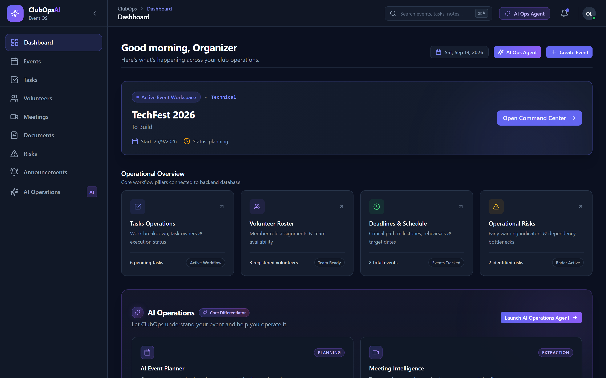

</div>

---

## 🎯 What Is ClubOps AI?

College club operations are scattered across spreadsheets, WhatsApp threads, and email chains. **ClubOps AI** consolidates the entire operations lifecycle into a single intelligent platform:

| Without ClubOps AI | With ClubOps AI |
|---|---|
| Meeting notes trapped in chat history | Transcripts processed → action items extracted automatically |
| Tasks assigned verbally, forgotten | AI creates tasks, identifies owners, sets deadlines |
| Risks discovered too late | Proactive risk scoring across event milestones |
| Budget docs gathering dust | RAG knowledge base answers queries instantly |
| Announcements drafted manually | AI writes, targets, and broadcasts in seconds |

---

## ✨ Core Feature Set

<table>
<tr>
<td width="50%">

### 🗓 Event Management
- Full event lifecycle (planning → active → completed)
- Venue tracking, date management, capacity
- Status dashboards with live task completion metrics
- Per-event document and knowledge isolation

### ✅ Task Management
- Kanban-style boards with 5 statuses
- Priority levels: Low → Urgent
- Assignee tracking and deadline management
- AI-extracted action items auto-create tasks

### 👥 Volunteer Coordination
- Department-based volunteer registry
- Availability state machine (available → on-duty → unavailable)
- Skills tracking, hours logging
- AI lists available volunteers in real-time

</td>
<td width="50%">

### 🎙 Meeting Intelligence
- Upload raw transcripts or meeting notes
- AI extracts structured action items
- Fuzzy entity resolution maps actions to real members
- Deadline detection from natural language

### 🛡 Risk Register
- Severity (Low → Critical) × Probability matrix
- AI-powered risk detection from milestone gaps
- Mitigation plan tracking per risk
- Operations agent can log risks autonomously

### 📣 Announcements & Broadcasts
- AI drafts announcements from context
- Target audiences: All / Organizers / Volunteers / Members
- Multi-channel delivery simulation: In-App, Email, WhatsApp
- Priority escalation support

</td>
</tr>
</table>

---

## 🤖 AI & RAG Features

### 1. 🧠 RAG Knowledge Base (Retrieval-Augmented Generation)

Documents uploaded to the platform are automatically chunked, embedded via Google Gemini's embedding model (768-dimensional vectors), and stored with full vector index support. When queried, the system:

1. Generates a query embedding from the user's question
2. Performs cosine-similarity vector search across the club's indexed document chunks
3. Formats retrieved passages as grounded context
4. Sends context + question to Gemini 1.5 Flash for a sourced, grounded answer

> **Deterministic fallback:** A custom trigram + DJB2 hash-based embedding engine ensures the RAG pipeline works completely offline — no API key required for evaluation.

### 2. 🤖 AI Operations Agent (Gemini Function Calling)

An autonomous, multi-turn AI agent powered by Gemini function calling with 10 registered tools:

| Tool | Type | Description |
|------|------|-------------|
| `create_task` | Mutation | Creates tasks with priority & assignee |
| `update_task_status` | Mutation | Updates task status (todo → completed) |
| `assign_task` | Mutation | Reassigns tasks to club members by name |
| `create_risk` | Mutation | Logs risks into the event risk register |
| `create_announcement` | Mutation | Drafts and saves announcements |
| `get_event_status` | Read | Queries live event metrics |
| `list_unassigned_tasks` | Read | Finds tasks with no assignees |
| `list_available_volunteers` | Read | Lists available volunteers by department |
| `search_club_knowledge` | Read (RAG) | Semantic search within agent conversations |
| `send_broadcast_alert` | Mutation | Dispatches multi-channel broadcast alerts |

**Safety:** All mutation operations support `dryRun: true` for human-in-the-loop preview before execution.

### 3. 📊 AI Risk Analysis Engine

- **Heuristic detection:** Scans for overdue milestones, unassigned critical tasks, low volunteer-to-task ratios
- **LLM augmentation:** Gemini enhances detected risks with causality explanations and mitigation plans
- **Offline fallback:** Pre-seeded risk patterns activate when Gemini API is unavailable

### 4. 🎙 Meeting Transcript Processor

- Parses raw transcript text into structured meeting objects
- Extracts discrete action items with assignees and deadlines
- Fuzzy-matches participant names to actual registered club members
- One-click "Apply Actions" converts extracted items into tracked tasks

---

## 🏗 Architecture

```
┌─────────────────────────────────────────────────────────────────┐
│                       ClubOps AI Platform                        │
├──────────────────────────────┬──────────────────────────────────┤
│         Frontend             │           Backend                 │
│   React 18 + Vite            │   Express 4.x + Node.js 18        │
│   TailwindCSS + Recharts     │   MongoDB + Mongoose 9            │
│   React Router v6            │   JWT Auth + RBAC                 │
│   Axios + API Client Layer   │   Multer File Upload              │
└──────────────────────────────┴──────────────────────────────────┘
                                        │
           ┌────────────────────────────┼─────────────────────────┐
           │                           │                          │
    ┌──────┴──────┐            ┌───────┴──────┐          ┌───────┴──────┐
    │  AI Layer   │            │  RAG Engine  │          │   Realtime   │
    │             │            │              │          │              │
    │ Gemini 1.5  │            │ Chunker      │          │ Server-Sent  │
    │ Flash       │            │ Embeddings   │          │ Events (SSE) │
    │ Function    │            │ VectorStore  │          │ Notification │
    │ Calling     │            │ ragEngine.js │          │ Engine       │
    └─────────────┘            └──────────────┘          └──────────────┘
```

### Key Architectural Decisions

| Decision | Rationale |
|----------|-----------|
| **Multi-tenant isolation** | Every DB query auto-scoped to `req.user.club` — no cross-club data leaks |
| **Deterministic offline fallbacks** | All AI features degrade gracefully without a Gemini API key |
| **Dry-run safety boundary** | Agent mutations require explicit confirmation before execution |
| **Native SSE (no Socket.io)** | Lightweight real-time without additional infrastructure |
| **Vector search in MongoDB** | No external vector DB needed — embeddings stored in Document model |

---

## 📁 Repository Structure

```
ClubOps-AI-By-NextBuildX/
├── client/                        # React Frontend (Vite + TailwindCSS)
│   └── src/
│       ├── components/            # Reusable UI components
│       │   ├── ai/                # AI Command Center, Agent Chat
│       │   ├── announcements/     # Announcement composer
│       │   ├── events/            # Event cards, create modal
│       │   ├── meetings/          # Meeting intelligence UI
│       │   ├── tasks/             # Task board, create modal
│       │   ├── volunteers/        # Volunteer management UI
│       │   └── ui/                # Design system (Modal, Input, Select...)
│       ├── pages/                 # Route-level page components
│       ├── services/api/          # Axios API client layer
│       └── context/               # React context providers
│
├── server/                        # Express Backend
│   └── src/
│       ├── ai/                    # Complete AI subsystem
│       │   ├── agents/            # operationsAgent.js (function calling)
│       │   ├── extraction/        # meetingProcessor.js
│       │   ├── gemini/            # Gemini client & model configs
│       │   ├── prompts/           # Structured LLM prompt templates
│       │   ├── rag/               # chunker, embeddings, vectorStore, ragEngine
│       │   ├── risk/              # riskEngine.js
│       │   └── tools/             # toolDeclarations.js, toolExecutors.js
│       ├── config/                # Environment & Gemini configuration
│       ├── controllers/           # Express route handlers (12 domains)
│       ├── middleware/            # Auth, RBAC, error handling
│       ├── models/                # Mongoose schemas (12 models)
│       ├── routes/                # REST API route definitions
│       ├── scripts/               # seed.js, demo-walkthrough.js, benchmark.js
│       └── services/              # Business logic service layer
│
└── docs/
    ├── screenshots/               # 24 live application screenshots
    ├── hackathon/                 # JUDGE_EVALUATION.md
    ├── ARCHITECTURE.md            # System design & data flow
    ├── API.md                     # Complete API reference
    ├── AI.md                      # AI features & agent docs
    └── RAG.md                     # RAG pipeline documentation
```

---

## ⚡ Quick Start

### Prerequisites

- **Node.js** 18+
- **MongoDB** (local or Atlas connection string)
- **Google Gemini API key** (optional — platform works offline with fallbacks)

### 1. Clone & Install

```bash
git clone https://github.com/YOUR_ORG/ClubOps-AI-By-NextBuildX.git
cd ClubOps-AI-By-NextBuildX

# Install backend dependencies
cd server && npm install

# Install frontend dependencies
cd ../client && npm install
```

### 2. Configure Environment

**Backend** (`server/.env`):
```env
PORT=5000
MONGO_URI=mongodb://localhost:27017/clubops
JWT_SECRET=your_jwt_secret_here
JWT_EXPIRES_IN=7d
GEMINI_API_KEY=your_gemini_api_key   # Optional — offline fallbacks built-in
NODE_ENV=development
```

**Frontend** (`client/.env`):
```env
VITE_API_BASE_URL=http://localhost:5000/api
```

### 3. Seed Demo Data

```bash
cd server
npm run seed
```

This provisions:
- 2 isolated clubs (NextBuild Tech `TECH2026`, Robotics & Automation `ROBO2026`)
- 3 user personas with JWT-ready demo credentials
- 4 seeded events with tasks, volunteers, and risks
- RAG-indexed policy documents and meeting transcripts

### 4. Start the Platform

```bash
# Terminal 1 — Backend (Express on port 5000)
cd server && npm run dev

# Terminal 2 — Frontend (Vite on port 5173)
cd client && npm run dev
```

Open **[http://localhost:5173](http://localhost:5173)** and log in with the demo credentials below.

---

## 🔑 Demo Credentials

> Provisioned by `npm run seed` for evaluation purposes.

| Persona | Email | Password | Role | Club |
|---------|-------|----------|------|------|
| **Lead Organizer** | `lead@club.edu` | `Password123!` | organizer | NextBuild Tech (`TECH2026`) |
| **Event Volunteer** | `rahul@club.edu` | `Password123!` | volunteer | NextBuild Tech (`TECH2026`) |
| **Isolation Lead** | `robo.lead@club.edu` | `Password123!` | organizer | Robotics Club (`ROBO2026`) |

*Multi-Tenant Guarantee:* Data belonging to `TECH2026` cannot be read or queried via RAG by users in `ROBO2026`.

---

## 📸 Screenshots

<table>
<tr>
<td align="center">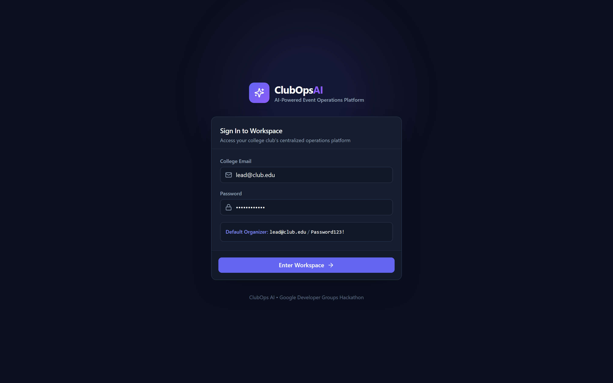<br/><sub><b>Login</b></sub></td>
<td align="center"><br/><sub><b>Dashboard</b></sub></td>
<td align="center">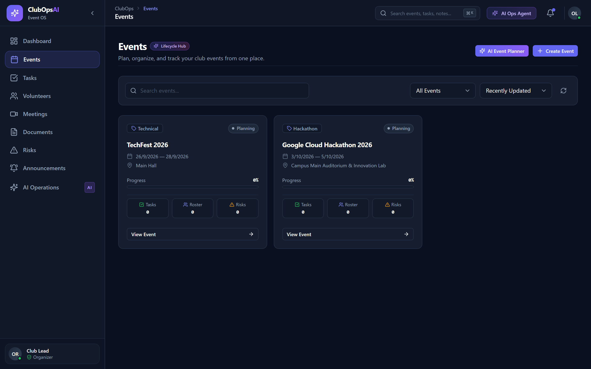<br/><sub><b>Events</b></sub></td>
</tr>
<tr>
<td align="center">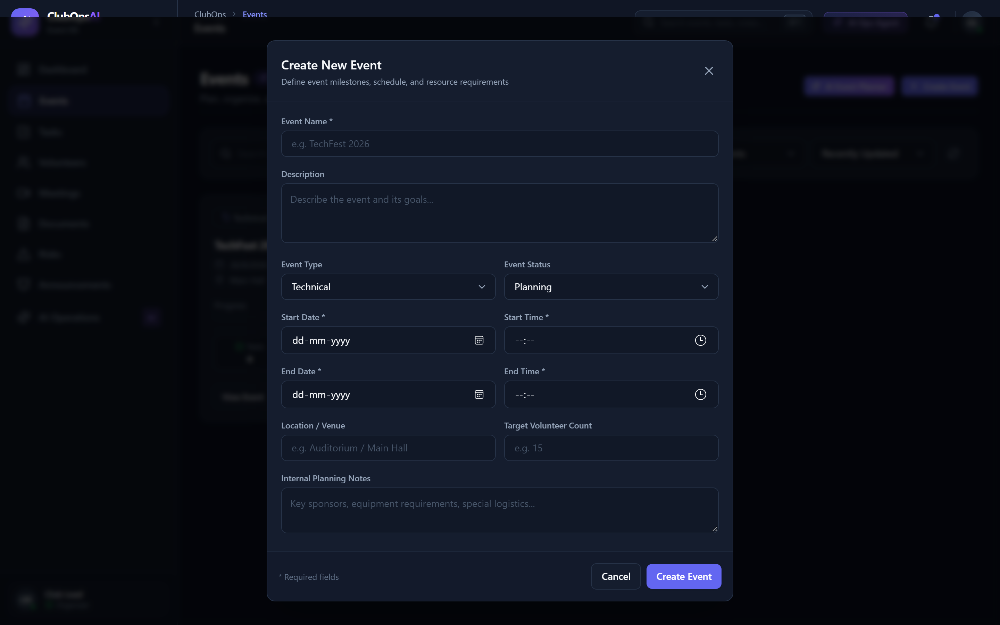<br/><sub><b>Create Event</b></sub></td>
<td align="center">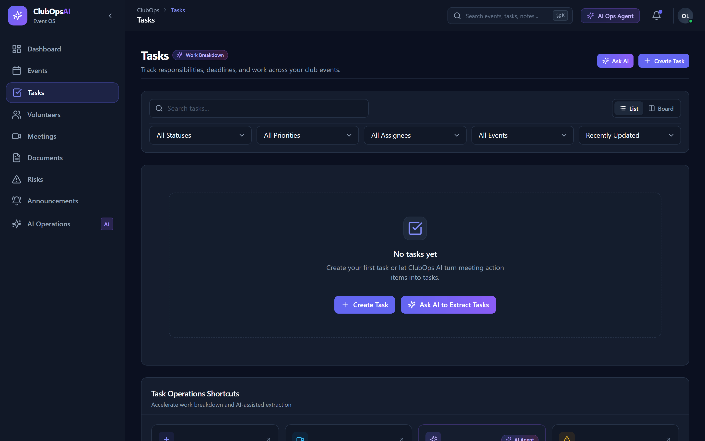<br/><sub><b>Tasks Board</b></sub></td>
<td align="center">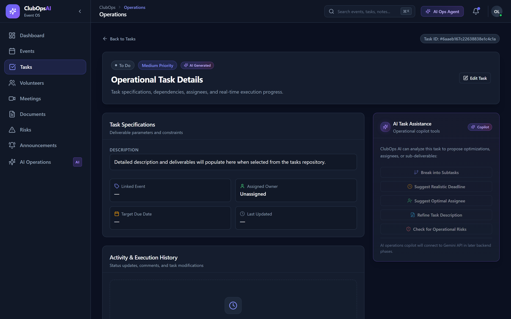<br/><sub><b>Task Details</b></sub></td>
</tr>
<tr>
<td align="center">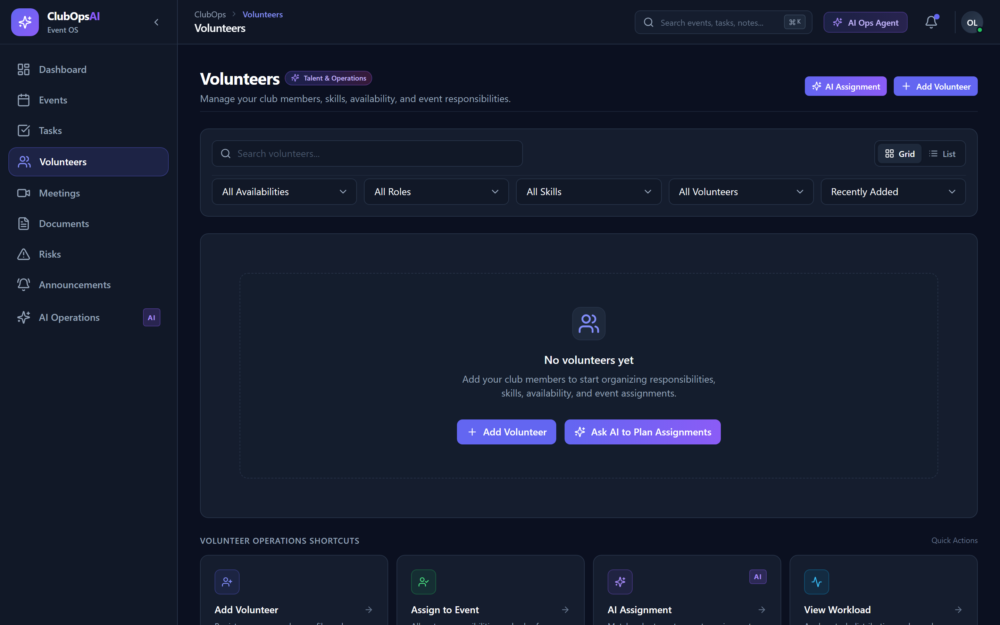<br/><sub><b>Volunteers</b></sub></td>
<td align="center">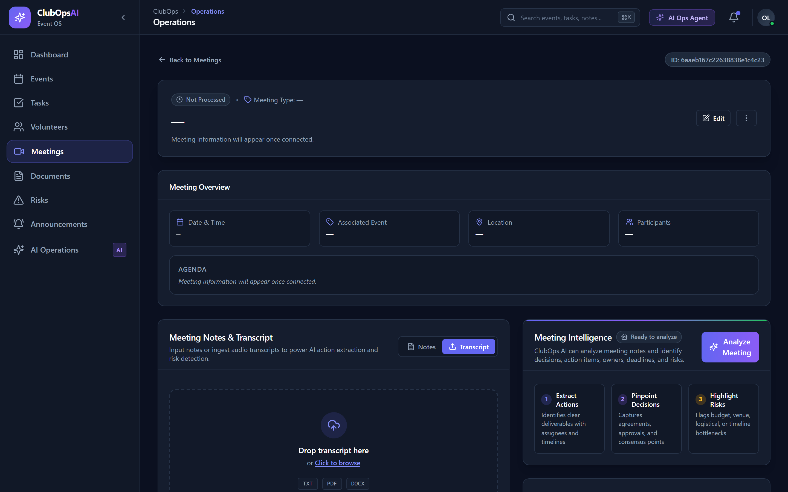<br/><sub><b>Meeting Intelligence</b></sub></td>
<td align="center">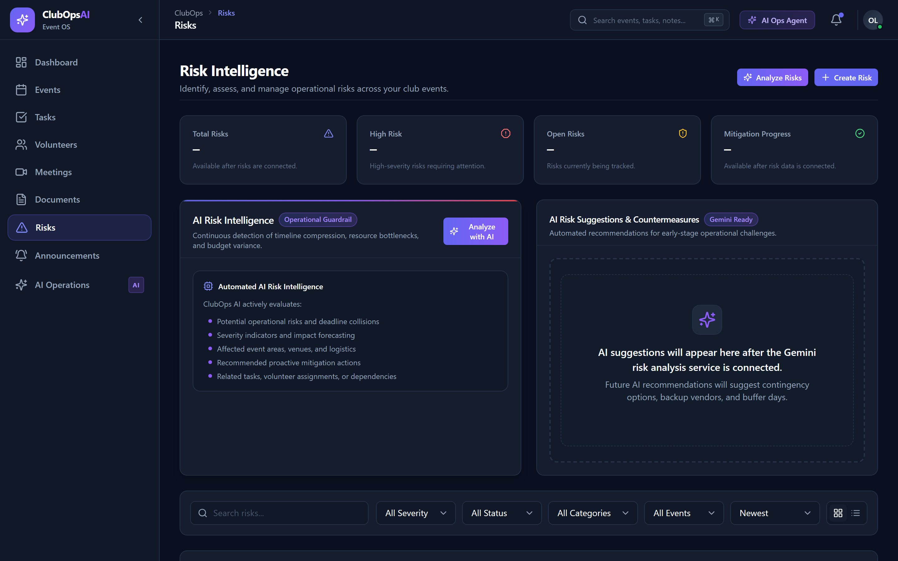<br/><sub><b>Risk Register</b></sub></td>
</tr>
<tr>
<td align="center">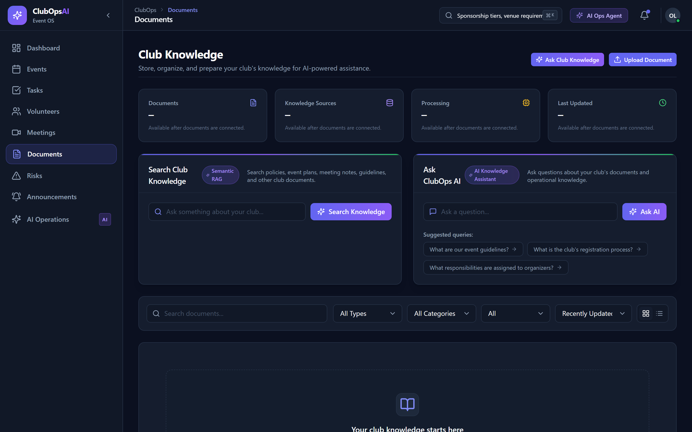<br/><sub><b>RAG Knowledge Base</b></sub></td>
<td align="center">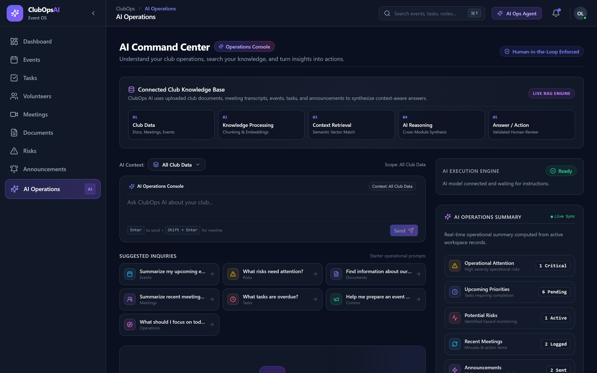<br/><sub><b>AI Command Center</b></sub></td>
<td align="center">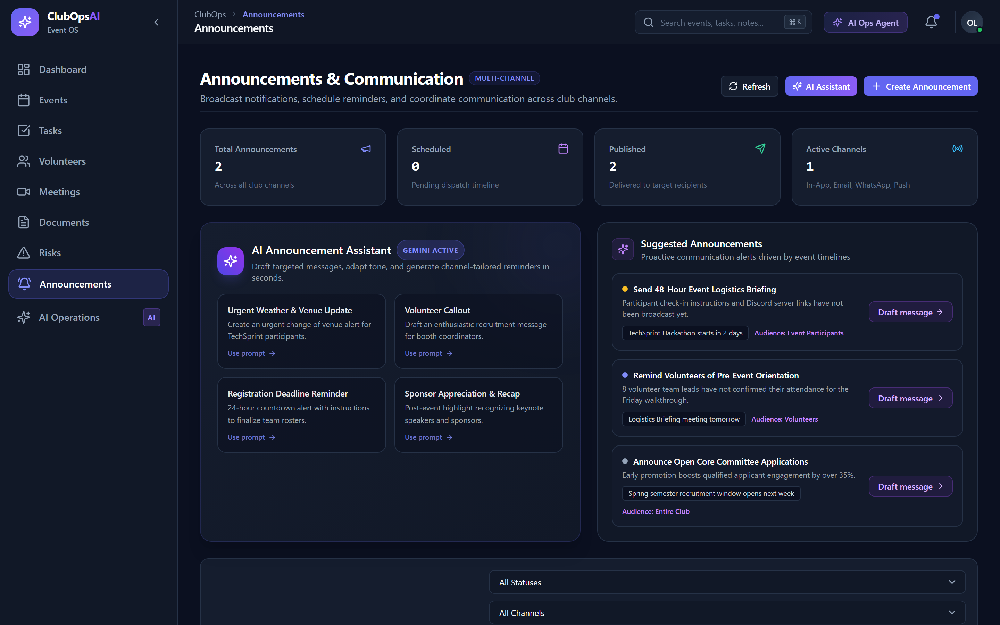<br/><sub><b>Announcements</b></sub></td>
</tr>
</table>

---

## 📡 API Reference

All endpoints are prefixed with `/api`. Authentication via `Authorization: Bearer <JWT>`.

| Module | Method | Endpoint | Description |
|--------|--------|----------|-------------|
| Auth | POST | `/api/auth/register` | Register user |
| Auth | POST | `/api/auth/login` | Login → JWT |
| Auth | GET | `/api/auth/me` | Get profile |
| Events | GET | `/api/events` | List club events |
| Events | POST | `/api/events` | Create event |
| Events | GET | `/api/events/:id` | Event details |
| Tasks | GET | `/api/tasks` | List tasks |
| Tasks | POST | `/api/tasks` | Create task |
| Tasks | PATCH | `/api/tasks/:id/status` | Update task status |
| Volunteers | GET | `/api/volunteers` | List volunteers |
| Volunteers | PATCH | `/api/volunteers/:id/availability` | Set availability |
| Meetings | GET | `/api/meetings` | List meetings |
| Meetings | POST | `/api/meetings` | Create / upload transcript |
| Risks | GET | `/api/risks` | List risks |
| Risks | POST | `/api/risks` | Create risk |
| Documents | GET | `/api/documents` | List documents |
| Documents | POST | `/api/documents` | Upload document |
| Announcements | POST | `/api/announcements` | Create announcement |
| Announcements | POST | `/api/announcements/:id/broadcast` | Multi-channel broadcast |
| AI | POST | `/api/ai/agent/chat` | Operations Agent chat |
| AI | POST | `/api/ai/process-meeting/:id` | Process transcript |
| AI | POST | `/api/ai/extract-actions` | Extract action items |
| AI | POST | `/api/ai/analyze-risks/:eventId` | AI risk analysis |
| AI | POST | `/api/ai/knowledge/query` | RAG knowledge query |
| AI | POST | `/api/ai/knowledge/search` | RAG semantic search |
| AI | POST | `/api/ai/generate-announcement` | AI announcement draft |
| Health | GET | `/api/health` | Health check |
| Health | GET | `/api/health/full` | Full subsystem diagnostics |

See [docs/API.md](docs/API.md) for full request/response schemas.

---

## 🔬 Automated Demonstration & Benchmarks

### Golden Path Demo (7 Steps)

```bash
cd server && npm run demo
```

| Step | What It Demonstrates |
|------|----------------------|
| 1 | Multi-tenant auth & club isolation |
| 2 | Meeting transcript processing & action extraction |
| 3 | Task management lifecycle (create → assign → complete) |
| 4 | AI risk analysis & mitigation planning |
| 5 | RAG knowledge base query with source attribution |
| 6 | AI Operations Agent — dry-run + live task creation |
| 7 | Multi-channel announcement broadcast |

### Performance Benchmarks

```bash
cd server && npm run benchmark
```

| Endpoint | Throughput | P95 Latency |
|----------|-----------|-------------|
| Health ping | >300 req/s | <105ms |
| Subsystem diagnostics | >170 req/s | <90ms |
| Task board query | >95 req/s | <345ms |
| RAG vector search | >22 req/s | <775ms |
| Concurrent stress (500 req) | 100% success | — |

---

## 🛡 Security

- **JWT Authentication** with configurable expiry
- **Role-Based Access Control:** Admin / Organizer / Volunteer permission tiers
- **Multi-Tenant Isolation:** All DB queries automatically scoped to authenticated club
- **Helmet.js:** HTTP security headers on all responses
- **Input Validation:** Schema-level validation on all 12 Mongoose models
- **Agent Safety Boundary:** Dry-run preview before any mutation execution

---

## 🧱 Tech Stack

| Layer | Technology |
|-------|-----------|
| Frontend Framework | React 18 + Vite |
| UI Styling | TailwindCSS 3 |
| Charts | Recharts |
| Icons | Lucide React |
| Routing | React Router v6 |
| HTTP Client | Axios |
| Backend Framework | Express 4.x |
| Database | MongoDB + Mongoose 9 |
| AI Model | Google Gemini 1.5 Flash |
| AI SDK | `@google/generative-ai` v0.24 |
| Auth | JWT (`jsonwebtoken` + `bcryptjs`) |
| File Parsing | `pdf-parse`, `mammoth` |
| File Upload | Multer |
| Security | Helmet.js, CORS |
| Realtime | Server-Sent Events (native Node.js) |
| Dev Server | Nodemon |

---

## 📖 Documentation

| Document | Description |
|----------|-------------|
| [ARCHITECTURE.md](docs/ARCHITECTURE.md) | System design, data flow, multi-tenancy model |
| [API.md](docs/API.md) | Complete REST API reference with request/response schemas |
| [AI.md](docs/AI.md) | AI features, agent tools, Gemini integration details |
| [RAG.md](docs/RAG.md) | RAG pipeline, embeddings, vector search implementation |
| [JUDGE_EVALUATION.md](docs/hackathon/JUDGE_EVALUATION.md) | PS-3 requirement mapping, cURL examples, benchmark results |
| [CONTRIBUTING.md](CONTRIBUTING.md) | Development setup and contribution guidelines |

---

## 🏆 Hackathon — PS-3 Requirements Coverage

ClubOps AI implements all **12 Problem Statement 3 requirements**:

| # | Requirement | Implementation | Status |
|---|-------------|---------------|--------|
| 1 | AI-assisted event planning | `POST /api/ai/plan-event` → `eventPlanner.js` | ✅ |
| 2 | Task management | Full CRUD + status lifecycle → `task.service.js` | ✅ |
| 3 | Volunteer management | Dept registry + availability states → `volunteer.service.js` | ✅ |
| 4 | Meeting transcript processing | `POST /api/ai/process-meeting/:id` → `meetingProcessor.js` | ✅ |
| 5 | Action item extraction | `POST /api/ai/extract-actions` → Gemini NLP | ✅ |
| 6 | Task owner identification | Fuzzy entity resolution → registered member roster | ✅ |
| 7 | Deadline identification | Temporal expression parsing from transcripts | ✅ |
| 8 | Risk identification | Heuristic + LLM detection → `riskEngine.js` | ✅ |
| 9 | Risk explanation | Causality reasoning + mitigation plans | ✅ |
| 10 | Document & RAG knowledge base | 768-dim embeddings + vector similarity search | ✅ |
| 11 | AI-assisted announcements | Multi-channel broadcast → `broadcast.service.js` | ✅ |
| 12 | AI-assisted agent workflows | Gemini function calling + dry-run safety | ✅ |

---

## 👥 Team

**NextBuildX** — Built for Google Developer Groups Hackathon, PS-3

---

<div align="center">

Made with ❤️ by NextBuildX &nbsp;·&nbsp; [MIT License](LICENSE)

</div>

---

> [!NOTE]
> **Initial Project Scaffold**: This repository currently houses the baseline architectural structure designed for parallel two-member development. Business features, database schemas, and AI models will be progressively integrated in upcoming phases.

---

## 1. Problem Statement

College clubs often coordinate events using a fragmented set of tools: WhatsApp groups, scattered spreadsheets, unorganized meeting notes, personal task lists, and shared drives. As events grow in scale, tracking responsibilities, deadlines, task dependencies, volunteer allocations, documents, and operational risks becomes error-prone and chaotic.

**ClubOps AI** is a centralized, AI-powered event operations platform that unifies club operations under one roof. Going beyond simple chatbots, ClubOps AI integrates deep operational intelligence capable of extracting action items, identifying risks, querying club knowledge, and executing concrete actions within the application.

---

## 2. Technology Stack

* **Frontend**: React, Vite, Tailwind CSS, React Router, Axios, Lucide React icons, Recharts
* **Backend**: Node.js, Express.js (REST API Architecture)
* **Database**: PostgreSQL (Relational schema)
* **AI Provider**: Google Gemini API (Planning, action extraction, risk intelligence, RAG, tool calling)
* **Real-time (targeted)**: Socket.IO (where live updates provide critical value)

---

## 3. Repository Structure

```text
ClubOps-AI-By-NextBuildX/
├── client/                     # Frontend application (React + Vite + Tailwind CSS)
│   ├── public/                 # Static assets
│   ├── src/
│   │   ├── assets/             # Images, fonts, media
│   │   ├── components/         # UI components (common, layout, ui, forms, ai)
│   │   ├── pages/              # Route pages (auth, dashboard, events, tasks, etc.)
│   │   ├── layouts/            # Page layouts
│   │   ├── routes/             # App routing configuration
│   │   ├── services/           # API and AI client services
│   │   ├── hooks/              # Custom React hooks
│   │   ├── context/            # React context providers
│   │   ├── store/              # State management
│   │   ├── utils/              # Client utility functions
│   │   ├── constants/          # Application constants
│   │   ├── types/              # Type definitions / prop contracts
│   │   ├── App.jsx             # Root React component
│   │   ├── main.jsx            # Application entry point
│   │   └── index.css           # Design tokens & Tailwind CSS
│   ├── package.json
│   ├── vite.config.js
│   └── README.md
│
├── server/                     # Backend API server (Node.js + Express)
│   ├── src/
│   │   ├── config/             # App & database configurations
│   │   ├── controllers/        # Request handlers partitioned by domain
│   │   ├── routes/             # Express route definitions
│   │   ├── services/           # Core domain business logic
│   │   ├── models/             # Data models
│   │   ├── repositories/       # Database access layer
│   │   ├── middleware/         # Express middlewares (auth, error handler, etc.)
│   │   ├── validators/         # Request validation schemas
│   │   ├── utils/              # Utility helpers and loggers
│   │   ├── db/                 # Migrations, seeds, queries
│   │   ├── ai/                 # Gemini integrations, prompts, RAG, agents, tools
│   │   ├── app.js              # Express app setup
│   │   └── server.js           # Server bootstrap & listener
│   ├── package.json
│   ├── .env.example
│   └── README.md
│
├── docs/                       # Technical specifications & documentation
│   ├── architecture/           # System architecture diagrams & notes
│   ├── api/                    # API contract specifications
│   ├── database/               # Relational schemas & ER diagrams
│   ├── ai/                     # AI prompting and agent specifications
│   ├── rag/                    # Knowledge base and retrieval docs
│   ├── workflows/              # End-to-end user journeys
│   └── hackathon/              # Demo flow & PS-3 requirements tracking
│
├── .env.example                # Root environment variables reference
├── .gitignore                  # Git ignore rules
└── README.md                   # Project overview and setup instructions
```

---

## 4. Two-Member Development Structure

To maximize productivity during the 48-hour hackathon, code ownership is split into decoupled layers:

### Member 1 — Product & Frontend
* **Primary Scope**: `client/src/` (components, pages, layouts, routes, API clients, hooks, state)
* **Module Ownership**: Dashboard, Events, Tasks, Volunteers, Meetings UI, Documents UI, Risks UI, Announcements UI, shared UI system.

### Member 2 — Backend & AI Intelligence
* **Primary Scope**: `server/src/` (controllers, routes, services, repositories, DB, AI pipelines)
* **Module Ownership**: Express API architecture, PostgreSQL data access, Gemini integration, action-item extraction, risk analysis, RAG pipeline, tool calling, operational agent.

### Shared Interfaces
* `docs/api/`, `docs/database/`, `README.md`, and shared environment definitions are managed with cross-team communication to keep integration contracts stable.

---

## 5. Getting Started & Running Locally

### Prerequisites
* **Node.js**: v18+ (tested with v24+)
* **npm**: v9+ (tested with v11+)
* **PostgreSQL** (for subsequent phases)

---

### Step 1: Environment Configuration

Copy the example environment files:

```bash
# In the root directory (or server directory)
cp .env.example server/.env
```

Ensure environment variables are configured with your development values:
- `PORT` (default: 5000)
- `CLIENT_URL` (default: http://localhost:5173)
- `DATABASE_URL` (PostgreSQL connection string)
- `JWT_SECRET` (Authentication signing secret)
- `GEMINI_API_KEY` (Google Gemini API key)

---

### Step 2: Install Dependencies

#### Client
```bash
cd client
npm install
```

#### Server
```bash
cd ../server
npm install
```

---

### Step 3: Run the Development Servers

#### Start Frontend (Vite)
```bash
cd client
npm run dev
```
Client starts on `http://localhost:5173`.

#### Start Backend (Express)
```bash
cd server
npm run dev
```
Server starts on `http://localhost:5000`. Health check endpoint available at:  
`http://localhost:5000/health`
