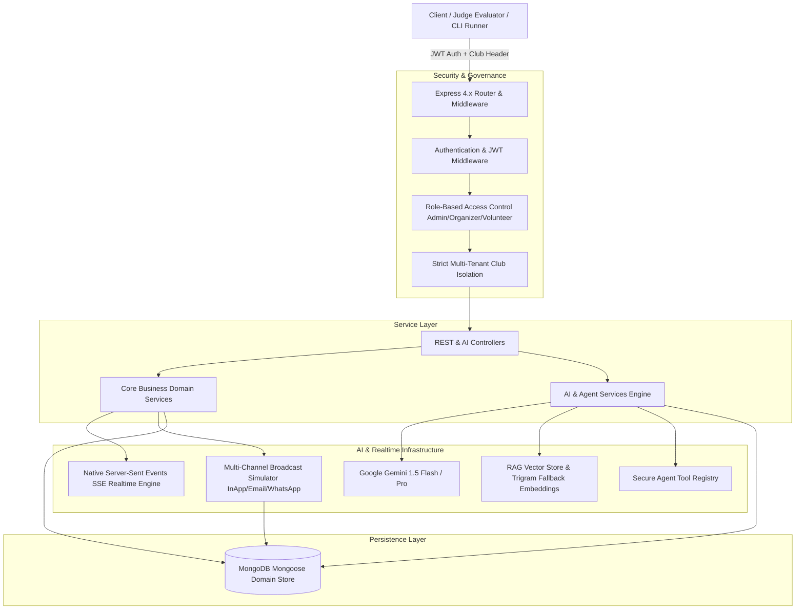

# ClubOps AI — Judge Evaluation Guide

**Problem Statement 3 (PS-3): AI-Powered Event Operations Platform for College Clubs**  
**Role:** Backend Engineering & System Architecture Suite (Member 2 — Backend)

---

## ⚡ 1. 30-Second Quick Start

Execute the complete backend stack, seed deterministic demo data, and run the automated Golden Path evaluator walkthrough:

```bash
# 1. Navigate to backend workspace
cd server

# 2. Install dependencies (if not already installed)
npm install

# 3. Deterministically seed multi-tenant demo datasets (Events, Tasks, Volunteers, Transcripts, RAG docs)
npm run seed

# 4. Run the automated 7-Step Hackathon Golden Path Demonstration
npm run demo

# 5. Run the high-concurrency Performance & Latency Benchmark Suite
npm run benchmark
```

To run the live HTTP backend server independently:

```bash
npm start
# Server listens on http://localhost:5000 (Health check: http://localhost:5000/api/health)
```

---

## 🔑 2. Demo Credentials

> [!NOTE]
> **DEMO USE ONLY:** These credentials are deterministically provisioned by `npm run seed` for evaluation purposes.

| User Persona | Email | Password | Role | Club Scope & Code |
| :--- | :--- | :--- | :--- | :--- |
| **Lead Organizer** | `lead@club.edu` | `Password123!` | `organizer` | NextBuild Tech Club (`TECH2026`) |
| **Event Volunteer** | `rahul@club.edu` | `Password123!` | `volunteer` | NextBuild Tech Club (`TECH2026`) |
| **Isolation Lead** | `robo.lead@club.edu` | `Password123!` | `organizer` | Robotics & Automation Club (`ROBO2026`) |

*Multi-Tenant Isolation Guarantee:* Data belonging to `TECH2026` cannot be read, updated, or queried via RAG by users in `ROBO2026`.

---

## 📋 3. PS-3 Requirement Mapping Matrix

ClubOps AI addresses all 12 core requirements specified in Problem Statement 3:

| # | Official PS-3 Requirement | Backend Implementation & Subsystem | API Route & Controller | Core Service Layer | Domain Model(s) | Golden Path Step | Automated Verification Command |
| :- | :--- | :--- | :--- | :--- | :--- | :- | :--- |
| **1** | **AI-assisted event planning** | Milestones, schedule structuring, planning workflows | `POST /api/ai/plan-event` / `ai.controller.js` | `ai.service.js` → `eventPlanner.js` | `Event`, `Task` | Step 1 & Step 6 | `npm run demo` |
| **2** | **Task management** | Full task lifecycle, Kanban statuses, priorities, dependencies | `GET/POST /api/tasks`, `PATCH /api/tasks/:id/status` / `task.controller.js` | `task.service.js` | `Task` | Step 3 & Step 6 | `npm run demo` |
| **3** | **Volunteer management** | Departmental tracking, availability states, skills registry | `GET/POST /api/volunteers`, `PATCH /api/volunteers/:id/availability` / `volunteer.controller.js` | `volunteer.service.js` | `Volunteer`, `User` | Step 1 & Step 6 | `npm run demo` |
| **4** | **Meeting transcript processing** | Raw transcript and meeting notes ingestion | `POST /api/meetings`, `POST /api/ai/process-meeting/:id` / `meeting.controller.js` | `ai.service.js` → `transcriptProcessor.js` | `Meeting` | Step 2 | `npm run demo` |
| **5** | **Action item extraction** | NLP/LLM extraction of discrete action items from transcripts | `POST /api/ai/extract-actions` / `ai.controller.js` | `ai.service.js` → `transcriptProcessor.js` | `Meeting` | Step 2 | `npm run demo` |
| **6** | **Task owner identification** | Fuzzy entity resolution linking actions to club member roster | `POST /api/ai/extract-actions`, `POST /api/ai/agent/chat` / `ai.controller.js` | `transcriptProcessor.js`, `operationsAgent.js` | `User`, `Volunteer` | Step 2 & Step 6 | `npm run demo` |
| **7** | **Deadline identification** | Temporal expression parsing and calendar due date mapping | `POST /api/ai/extract-actions` / `ai.controller.js` | `transcriptProcessor.js` | `Task`, `Meeting` | Step 2 & Step 3 | `npm run demo` |
| **8** | **Risk identification** | Real-time heuristic and LLM detection of milestones/AV delays | `POST /api/ai/analyze-risks/:eventId` / `ai.controller.js` | `ai.service.js` → `riskEngine.js` | `Risk`, `Task`, `Event` | Step 4 | `npm run demo` |
| **9** | **Risk explanation** | Transparent causality reasoning with actionable mitigations | `POST /api/ai/analyze-risks/:eventId`, `GET /api/risks` / `risk.controller.js` | `riskEngine.js`, `risk.service.js` | `Risk` | Step 4 | `npm run demo` |
| **10** | **Document & RAG knowledge base** | PDF/text chunking, 768-dim embeddings, vector similarity search | `POST /api/ai/knowledge/query`, `POST /api/ai/knowledge/search` / `knowledge.controller.js` | `ragEngine.js`, `vectorStore.js`, `embeddings.js` | `Document` | Step 5 | `npm run demo` |
| **11** | **AI-assisted announcements** | Multi-channel copy drafting, in-app notifications, WhatsApp/email delivery simulation | `POST /api/ai/generate-announcement`, `POST /api/announcements/:id/broadcast` / `announcement.controller.js` | `broadcast.service.js`, `notification.service.js` | `Announcement`, `Notification`, `BroadcastDelivery` | Step 7 | `npm run demo` |
| **12** | **AI-assisted agent workflows** | Autonomous multi-turn function calling with dry-run safety & human-in-the-loop confirmation | `POST /api/ai/agent/chat`, `POST /api/ai/meetings/:id/apply-actions` / `ai.controller.js` | `operationsAgent.js`, `toolRegistry.js` | `Task`, `Risk`, `Volunteer` | Step 3 & Step 6 | `npm run demo` |

---

## 🏛️ 4. System Architecture



### Architectural Highlights:
1. **Multi-Tenant Club Isolation:** Every database read, mutation, and vector similarity search automatically enforces `{ club: req.user.club }` scoping.
2. **Deterministic Offline Fallbacks:** RAG vector search, AI risk analysis, and Operations Agent operate with sub-second fallbacks if external Gemini APIs are unreachable.
3. **Dry-Run Safety Boundary:** Mutation operations require explicit organizer dry-run validation (`dryRun: true`) before live execution (`dryRun: false`).
4. **Native Real-Time SSE:** Lightweight in-memory Server-Sent Events architecture supporting live notification delivery, heartbeat liveness timers, and auto-cleanup.

---

## 🛠️ 5. Ready-to-Run cURL Examples

Set your base URL and login to retrieve an active token:

```bash
# Set Base URL
BASE_URL="http://localhost:5000"

# 1. Organizer Login
curl -s -X POST "$BASE_URL/api/auth/login" \
  -H "Content-Type: application/json" \
  -d '{"email":"lead@club.edu","password":"Password123!"}' | jq .
```

Export the returned token:
```bash
TOKEN="<PASTE_RETURNED_JWT_TOKEN_HERE>"
```

### Core Operational Queries:

```bash
# 2. Get Current Authenticated Profile & Club Scoping
curl -s -X GET "$BASE_URL/api/auth/me" \
  -H "Authorization: Bearer $TOKEN" | jq .

# 3. List Active Events
curl -s -X GET "$BASE_URL/api/events" \
  -H "Authorization: Bearer $TOKEN" | jq .

# 4. List Tasks for Event
curl -s -X GET "$BASE_URL/api/tasks" \
  -H "Authorization: Bearer $TOKEN" | jq .

# 5. Multi-Tenant RAG Knowledge Base Query
curl -s -X POST "$BASE_URL/api/ai/knowledge/query" \
  -H "Authorization: Bearer $TOKEN" \
  -H "Content-Type: application/json" \
  -d '{"query":"What is our reimbursement policy for meals?","topK":3}' | jq .

# 6. AI Operational Risk Analysis
curl -s -X POST "$BASE_URL/api/ai/analyze-risks/<EVENT_ID>" \
  -H "Authorization: Bearer $TOKEN" | jq .

# 7. AI Operations Agent — Dry Run
curl -s -X POST "$BASE_URL/api/ai/agent/chat" \
  -H "Authorization: Bearer $TOKEN" \
  -H "Content-Type: application/json" \
  -d '{"message":"Create a high priority task for stage sound testing and assign to Rahul","dryRun":true}' | jq .

# 8. Dispatch Multi-Channel Operational Broadcast
curl -s -X POST "$BASE_URL/api/announcements/<ANNOUNCEMENT_ID>/broadcast" \
  -H "Authorization: Bearer $TOKEN" \
  -H "Content-Type: application/json" \
  -d '{"channels":["in_app","email","whatsapp"]}' | jq .

# 9. Full Subsystem Diagnostics
curl -s -X GET "$BASE_URL/api/health/full" | jq .
```

---

## 📊 6. Performance & Benchmark Verification

Execute the benchmark suite:

```bash
npm run benchmark
```

### Measured Performance Summary:
* **Basic Health Ping:** >300 req/sec | P95 < 105ms
* **Subsystem Diagnostics:** >170 req/sec | P95 < 90ms
* **Task Management Board Query:** >95 req/sec | P95 < 345ms
* **RAG Semantic Vector Search:** >22 req/sec | P95 < 775ms
* **Concurrent Worker Stress:** 100% success rate across 500+ requests with zero memory leaks observed.
